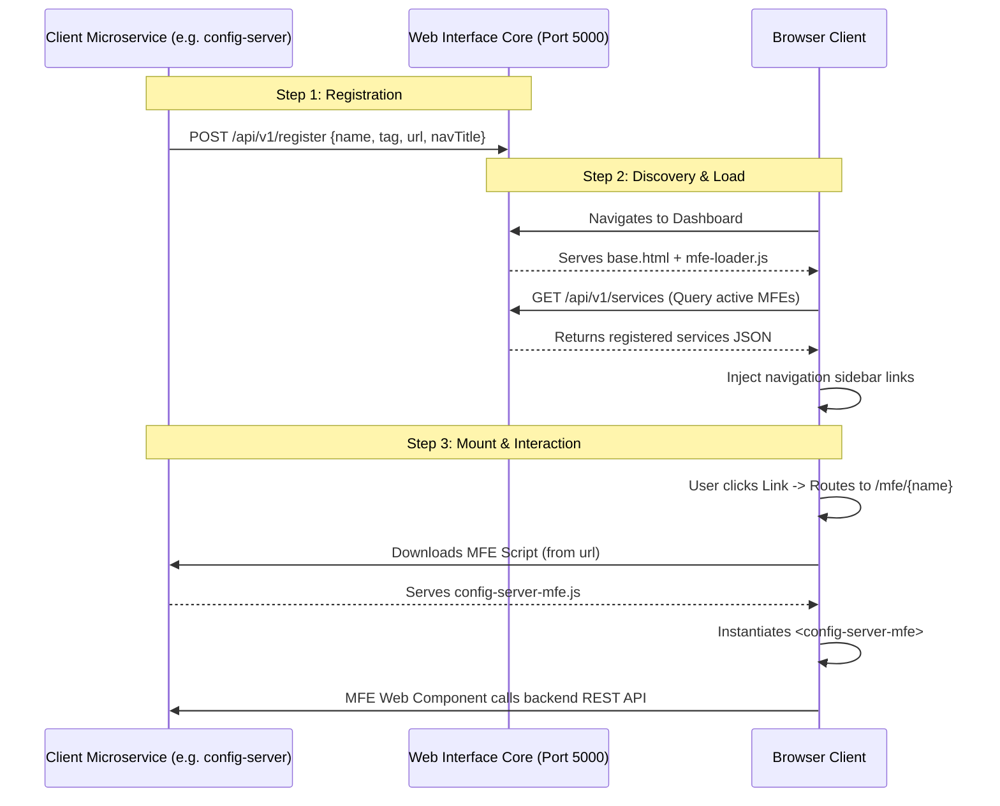

# 🌐 OpenMFE Microfrontend Integration Protocol

This protocol defines how to build, register, and test pluggable, decentralized user interfaces (Microfrontends) in the Bastien Ecosystem using the **OpenMFE standard** and HTML5 Web Components.

---

## 1. High-Level Architecture

The `web-interface` server includes an integrated **MFE Registry** and a client-side **MFE Loader** to mount sub-frontends dynamically without rebuilding the core server.



---

## 2. Integration Specifications

### 2.1 The Registry Endpoints
The registry is built directly into the `web-interface` server on **Port 5000** (or the currently configured server port).
- **POST `/api/v1/register`**: Used by microservices at boot time to publish their frontend configuration.
  ```json
  {
    "name": "config-server",
    "tag": "config-server-mfe",
    "url": "http://localhost:3308/static/mfe.js",
    "navTitle": "⚙️ Config Server"
  }
  ```
- **GET `/api/v1/services`**: Used by the web interface loader to fetch all active frontends.

### 2.2 Client-Side Requirements (The Microservice)
To expose a microfrontend, a sibling microservice must fulfill three strict technical conditions:

#### 1. Serve the Web Component Script (Embedded Standard)
To prevent runtime filesystem path lookup issues in containerized (Docker) or multi-environment setups, the Web Component bundle (`mfe.js`) should be embedded directly into the microservice binary.

*   **Go (Native `//go:embed` - Recommended)**:
    Place the script in the handler's package directory (e.g. `src/rest/mfe.js`) and embed it inside the router handler:
    ```go
    import _ "embed"

    //go:embed mfe.js
    var mfeJS string

    func (h *RESTHandler) RegisterRoutes(mux *http.ServeMux) {
        // ...
        mfeHandler := func(w http.ResponseWriter, r *http.Request) {
            w.Header().Set("Content-Type", "application/javascript")
            w.Write([]byte(mfeJS))
        }
        mux.HandleFunc("/static/js/mfe-loader.js", mfeHandler)
        mux.HandleFunc("/static/mfe.js", mfeHandler) // Legacy path support
    }
    ```

*   **Go Legacy Path (Disk-based fallback)**:
    ```go
    fs := http.FileServer(http.Dir("web/static"))
    mux.Handle("/static/", http.StripPrefix("/static/", fs))
    ```

*   **Python (FastAPI)**:
    ```python
    from fastapi.staticfiles import StaticFiles
    app.mount("/static", StaticFiles(directory="web/static"), name="static")
    ```

#### 2. Support CORS (Cross-Origin Resource Sharing)
Because the Web Component executes in the client's browser (loaded under the `web-interface` domain, e.g., `localhost:5000`), browser security will block direct API queries to your microservice (running on a different port, e.g., `localhost:3308`) unless CORS headers are explicitly sent.
*   **Go (CORS Middleware)**:
    ```go
    func CorsMiddleware(next http.Handler) http.Handler {
        return http.HandlerFunc(func(w http.ResponseWriter, r *http.Request) {
            w.Header().Set("Access-Control-Allow-Origin", "*") // Restrict to web-interface in production
            w.Header().Set("Access-Control-Allow-Methods", "GET, POST, OPTIONS, PUT, DELETE")
            w.Header().Set("Access-Control-Allow-Headers", "Content-Type, Authorization")
            
            if r.Method == "OPTIONS" {
                w.WriteHeader(http.StatusOK)
                return
            }
            next.ServeHTTP(w, r)
        })
    }
    ```
*   **Python (FastAPI CORS Middleware)**:
    ```python
    from fastapi.middleware.cors import CORSMiddleware
    
    app.add_middleware(
        CORSMiddleware,
        allow_origins=["*"],
        allow_credentials=True,
        allow_methods=["*"],
        allow_headers=["*"],
    )
    ```

#### 3. Automatic Non-Blocking Boot Registration
During initial bootstrap (Phase 5 of service initialization), the microservice must fire a non-blocking POST request to the MFE registry. It must run on a background thread/goroutine to prevent startup locks if the `web-interface` is offline.
*   **Go Auto-Registration Hook**:
    ```go
    go func() {
        // Fetch addresses from toolbox config
        regUrl := "http://localhost:5000/api/v1/register" 
        mfeUrl := "http://localhost:3308/static/mfe.js"
        
        payload := fmt.Sprintf(`{
            "name": "config-server",
            "tag": "config-server-mfe",
            "url": "%s",
            "navTitle": "⚙️ Config Server"
        }`, mfeUrl)
        
        // Retry loop to handle boot staging
        for i := 0; i < 5; i++ {
            resp, err := http.Post(regUrl, "application/json", strings.NewReader(payload))
            if err == nil {
                resp.Body.Close()
                return
            }
            time.Sleep(3 * time.Second)
        }
    }()
    ```
*   **Python Auto-Registration Hook**:
    ```python
    import threading
    import requests
    import time
    
    def register_mfe():
        payload = {
            "name": "market-observer",
            "tag": "market-observer-mfe",
            "url": "http://localhost:8081/static/mfe.js",
            "navTitle": "📈 Market Observer"
        }
        for _ in range(5):
            try:
                r = requests.post("http://localhost:5000/api/v1/register", json=payload, timeout=3)
                if r.status_code == 201:
                    break
            except Exception:
                time.sleep(3)
                
    threading.Thread(target=register_mfe, daemon=True).start()
    ```

### 2.3 The Web Component Standard
The microfrontend bundle must register a standard custom HTML5 element. It receives context variables dynamically from the parent loader via attributes (e.g. `base-url`):

```javascript
class ConfigServerMFE extends HTMLElement {
    async connectedCallback() {
        // Inherits parent window location unless explicitly passed
        const baseUrl = this.getAttribute('base-url') || window.location.origin;
        this.innerHTML = `
            <div class="w3-container w3-padding-16">
                <h2 class="w3-border-bottom w3-border-light-grey w3-padding-16">⚙️ Configuration Server</h2>
                <div id="config-list" class="w3-card-4 w3-white w3-padding">
                    <p><i class="fa fa-spinner fa-spin"></i> Fetching active parameters...</p>
                </div>
            </div>
        `;
        this.loadParameters();
    }

    async loadParameters() {
        try {
            // Direct REST communication with microservice (on Port 3308, bypassing facade if needed)
            const res = await fetch('http://localhost:3308/api/v1/config/list');
            const data = await res.json();
            this.renderConfig(data.json_config);
        } catch (err) {
            this.querySelector('#config-list').innerHTML = `<p class="w3-text-red">Error: ${err.message}</p>`;
        }
    }

    renderConfig(jsonConfig) {
        // Render editable fields, update forms, and bind submit to config-server POST API
    }
}
customElements.define('config-server-mfe', ConfigServerMFE);
```

### 2.4 Thematic UI Alignment (Theme Inheritance)
To ensure that pluggable Web Components blend seamlessly into the `web-interface` dashboard shell, they **must not** use hardcoded HEX or RGB colors for themeable elements.

Instead, they must inherit the parent container's styles using **Bastien UI Design Tokens** (CSS variables). These variables are globally defined on the `<html>` or `<body>` tag and change automatically based on active theme settings (e.g., Dark, Light, High Contrast).

#### Required Design Token Variables:
- **Backdrops**: `var(--color-bg-primary)`, `var(--color-bg-secondary)`, `var(--color-bg-surface)`
- **Text**: `var(--color-text-primary)`, `var(--color-text-secondary)`, `var(--color-text-muted)`
- **Accents**: `var(--color-accent-primary)`, `var(--color-accent-success)`, `var(--color-accent-warning)`, `var(--color-accent-danger)`
- **Fonts**: `var(--font-sans)`, `var(--font-display)`, `var(--font-mono)`
- **Sizing**: `var(--font-size-xs)`, `var(--font-size-sm)`, `var(--font-size-base)`, `var(--font-size-lg)`, `var(--font-size-xl)`, `var(--font-size-2xl)`

#### Outer Container & Dynamic Responsive Header Spacing Contract:
To prevent topbar header overlap and ensure fluid, responsive centering across all viewports (Mobile, Tablet, Desktop, Ultra-Wide) for microservices (`config-server`, `notif-server`, `watchdog-agent`, `obsidian-brain` RAG Engine, `squad-control`), every Web Component root container enforces fluid `clamp()` layout math:

```css
.mfe-container, .squad-container, .rag-mfe {
    font-family: var(--font-sans, system-ui, sans-serif);
    color: var(--color-text-primary, #e2e8f0);
    width: 100%;
    max-width: var(--content-max-width, 1400px);
    margin: 0 auto;
    padding: clamp(1.25rem, 2.5vh, 2.25rem) clamp(1.25rem, 3vw, 2.5rem) 3.5rem;
    box-sizing: border-box;
}
```
* **Dynamic Fluid Header Clearance**: `<main id="main" class="bastien-main">` provides `--header-spacing-fluid: calc(var(--topbar-height) + clamp(2.5rem, 5vh, 4.5rem))` (~88px to 120px depending on viewport height).
* **Component Display**: Custom element tags (`<config-server-mfe>`, `<watchdog-agent-mfe>`, etc.) are assigned `display: block; width: 100%; box-sizing: border-box;`.

#### Styling Example (Embedded CSS inside component template):
Define the component's styles utilizing the variables, and provide safe fallback values for standalone rendering:
```css
.mfe-container {
    font-family: var(--font-sans, system-ui, sans-serif);
    color: var(--color-text-primary, #333);
    width: 100%;
    max-width: 1200px;
    margin: 0 auto;
    padding: 16px 24px 40px;
    box-sizing: border-box;
}
.mfe-card {
    background: var(--color-bg-surface, #ffffff);
    border: 1px solid var(--color-bg-secondary, #edf2f7);
}
.mfe-card-title {
    color: var(--color-text-muted, #718096);
    font-size: var(--font-size-xs, 0.75rem);
}
.mfe-mono-data {
    font-family: var(--font-mono, monospace);
}
```

---

## 3. How to Test & Verify

Follow these steps to run a local sandbox validation:

### 1. Boot up the Web Interface
Navigate to the web interface directory and start the server:
```bash
cd web-interface
go run ./cmd/web-interface
```

### 2. Register a Mockup Service
Simulate a microservice startup by registering a mockup metadata node:
```bash
curl -X POST http://localhost:5000/api/v1/register \
  -H "Content-Type: application/json" \
  -d '{
    "name": "mock-service",
    "tag": "mock-mfe",
    "url": "/static/js/ta-indicators.js",
    "navTitle": "🧪 Mockup Service"
  }'
```

### 3. Open the Dashboard
Open the main `web-interface` (`http://localhost:5000`):
1. **Dynamic Navigation:** The sidebar under `MicroServices` should automatically render the link **🧪 Mockup Service**.
2. **Mounting:** Clicking the link loads `/mfe/mock-service`. The loader downloads `ta-indicators.js` and mounts `<mock-mfe>` dynamically inside the page frame.
