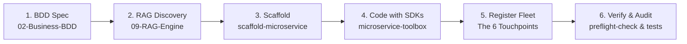

# AGENTS.md: 08-Base-Scripts

## Service Mission & Architecture Role
`08-Base-Scripts` is the operational engine room, autonomous AI squad coordinator, and fleet governance automation hub for the Bastien-Antigravity ecosystem. It exposes a unified CLI router (`main.py`) providing commands for ecosystem health audits, fleet-wide git and architecture management, automated microservice scaffolding, and AI persona synchronization.

- **Unified CLI Entrypoint**: `python3 08-Base-Scripts/main.py <command> [args...]`
- **Execution Environment**: Vault Python virtual environment (`.venv`) initialized via `src/bootstrap` using `microservice-toolbox` Python bindings.
- **RAG Engine Integration**: Paired with [`09-RAG-Engine`](file:///Users/imac/Desktop/Bastien-Antigravity/obsidian-brain/09-RAG-Engine) for semantic context retrieval, interface discovery, and AST code queries.
- **Configuration Link**: `standalone.yaml -> ../docker-deployment/modes/local/config/native.yaml`

---

## Unified Command Directory

All operational scripts are invoked through the central `main.py` router:

### 1. Squad Lifecycle & Scaffolding
- `start-squad`: Main orchestrator. Runs preflight audits, synchronizes agent roles, and boots the AI squad environment.
- `scaffold-microservice`: **Automated Microservice Generator**. Scaffolds new Go, Python, or Rust microservices with standard directories, the 9 mandatory root files, BDD spec stubs, and registration snippets.
- `scaffold-new-brain`: Generates a new standardized Obsidian documentation vault.
- `switch-mode`: Protocol switcher toggling between Spec-First, Labs, and Fleet operational modes.
- `unlock-vault`: Manages encryption and vault access protocols.
- `install-git-hooks`: Installs repository pre-commit and pre-push hooks across the fleet.

### 2. Auditing & Health Verification
- `preflight-check`: Mandatory pre-session audit verifying configuration validity, ports, and environment integrity.
- `brain-health-audit`: Scans the entire `obsidian-brain` vault for orphan notes, missing tags, and invalid frontmatter.
- `check-coherence`: Audits runtime agent skills against vault role prompts to ensure 100% coherence.
- `ensure-frontmatter`: Validates and repairs YAML frontmatter across all markdown files.
- `hardening-yaml`: Audits and hardens ecosystem YAML files against syntax and schema drift.

### 3. Fleet & Feature Management
- `fleet-commander`: Fleet-wide git and deployment coordinator. Interacts with `05-Fleet-Operation/00-Repo-Control/fleet-manager.py` to enforce compliance and manage multi-repo pushes.
- `map-feats`: Maps BDD feature specifications (`02-Business-BDD`) to concrete implementation code.
- `fix-feats`: Auto-aligns feature documentation status with actual codebase state.
- `close-mission`: Performs terminal session wrap-up, updates `AI-Session-State.md`, and persists context.
- `convert-agents`: **AI Persona Compiler**. Reads the 14 squad role prompts from `07-Core-KMS/Role-Prompts/` and compiles them into active Antigravity skills in `.agents/skills/<role>/SKILL.md`.

### 4. Knowledge & Memory Management
- `knowledge-compressor`: Distills session transcripts and log buffers into persistent knowledge items.
- `persona-extractor`: Analyzes codebase patterns and updates agent persona specializations.
- `joint-audit-purger`: Identifies obsolete notes, orphan branches, and dead code candidates.

---

## RAG Engine Workflow Integration (`09-RAG-Engine`)

Before creating or modifying microservices, AI agents must leverage the local hybrid RAG engine rather than performing blind file searches:

```bash
# Query the knowledge base and AST-indexed source code
python3 09-RAG-Engine/main.py query "<search-topic>"

# Example: Check interface contracts
python3 09-RAG-Engine/main.py query "SafeSocket framing protocol"

# Example: Check capability configuration schema
python3 09-RAG-Engine/main.py query "timescale_db capability structure"
```

The RAG engine merges BM25 lexical keyword matching with `BAAI/bge-m3` dense vector embeddings and reranks results via `BAAI/bge-reranker-base`, returning precise markdown sections and function-level AST code chunks.

---

## Autonomous Microservice Development Workflow

Whenever an AI agent is tasked with creating a new microservice or modifying an existing one, it **MUST** execute the standard 6-phase lifecycle:



1. **BDD Specification (`02-Business-BDD`)**:
   - Locate or author the feature specification in `02-Business-BDD/02-Behavior-Specs/<service>/FEAT-*.md`.
   - Verify user story, Gherkin scenarios (`Given`/`When`/`Then`), and acceptance criteria.
2. **Architecture & RAG Discovery (`03-Tech-Stack` & `09-RAG-Engine`)**:
   - Query RAG for existing interfaces, protocols, and ADRs.
   - Confirm compliance with `03-Tech-Stack/02-Project-Architecture/` standards (`11-Microservice-Integration-Standard.md`, `12-Docker-Deployment-Standards.md`).
3. **Automated Scaffolding (`scaffold-microservice`)**:
   - Run `python3 08-Base-Scripts/main.py scaffold-microservice --name <service-name> --lang <go|python|rust>` to generate the clean skeleton and all required root files.
4. **Implementation via Ecosystem SDKs**:
   - Use `microservice-toolbox` for `BootstrapService`, configuration, and lifecycle management.
   - Use `universal-logger` for structured logging.
   - Use `safe-socket` for high-throughput framed TCP transports.
5. **Ecosystem Fleet Registration (The 6 Touchpoints)**:
   - 1. Register in `05-Fleet-Operation/00-Repo-Control/service-registry.json` (canonical port, image, protocol).
   - 2. Register in `05-Fleet-Operation/00-Repo-Control/inventory.json` (repository path, remote, branch).
   - 3. Add capability block to `docker-deployment/modes/local/config/native.yaml`.
   - 4. Add container service to `docker-deployment/docker-compose.yaml`.
   - 5. Register symlink in `watchdog-agent/src/config/heal.go`.
   - 6. If UI/API exists, register OpenMFE with `web-interface` (port 5000) or C2 with `tele-remote` (port 1863).
6. **Verification & Preflight Audit**:
   - Run unit tests: `go test -v ./...` / `pytest` / `cargo test`.
   - Run preflight check: `python3 08-Base-Scripts/main.py preflight-check`.
   - Update `AI-Session-State.md`.

---

## AI Development Guidelines
1. **Bootstrap Pattern**: Python modules in this directory import `src.bootstrap` to redirect execution to the virtualenv and initialize `microservice-toolbox` config and logger singletons.
2. **Triple-Block Header**: Every Python file MUST begin with the Triple-Block docstring (`ESSENTIAL PROCESS`, `DATA FLOW`, `KEY PARAMETERS`).
3. **Section Dividers**: Use `# -----------------------------------------------------------------------------` between top-level functions and classes.
4. **Never Hardcode Paths**: Always resolve the workspace root dynamically via `Path(__file__).resolve()` or `bootstrap`.
5. **No Broken Links**: Cross-references to notes must use valid obsidian wikilinks `[[Note-Name]]` or relative markdown paths.
