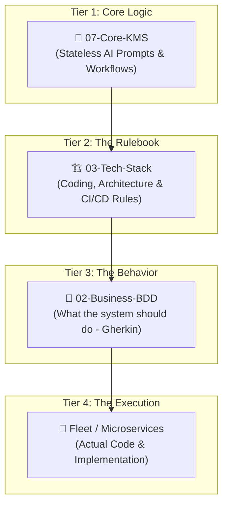
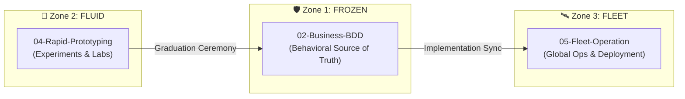
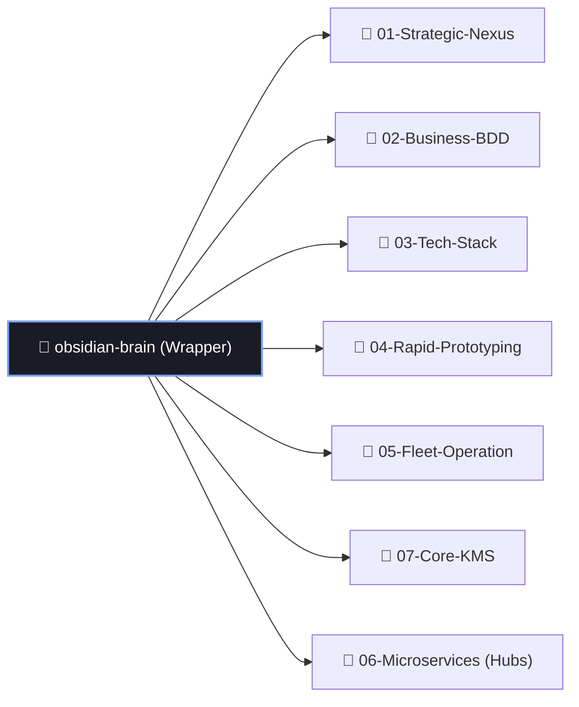
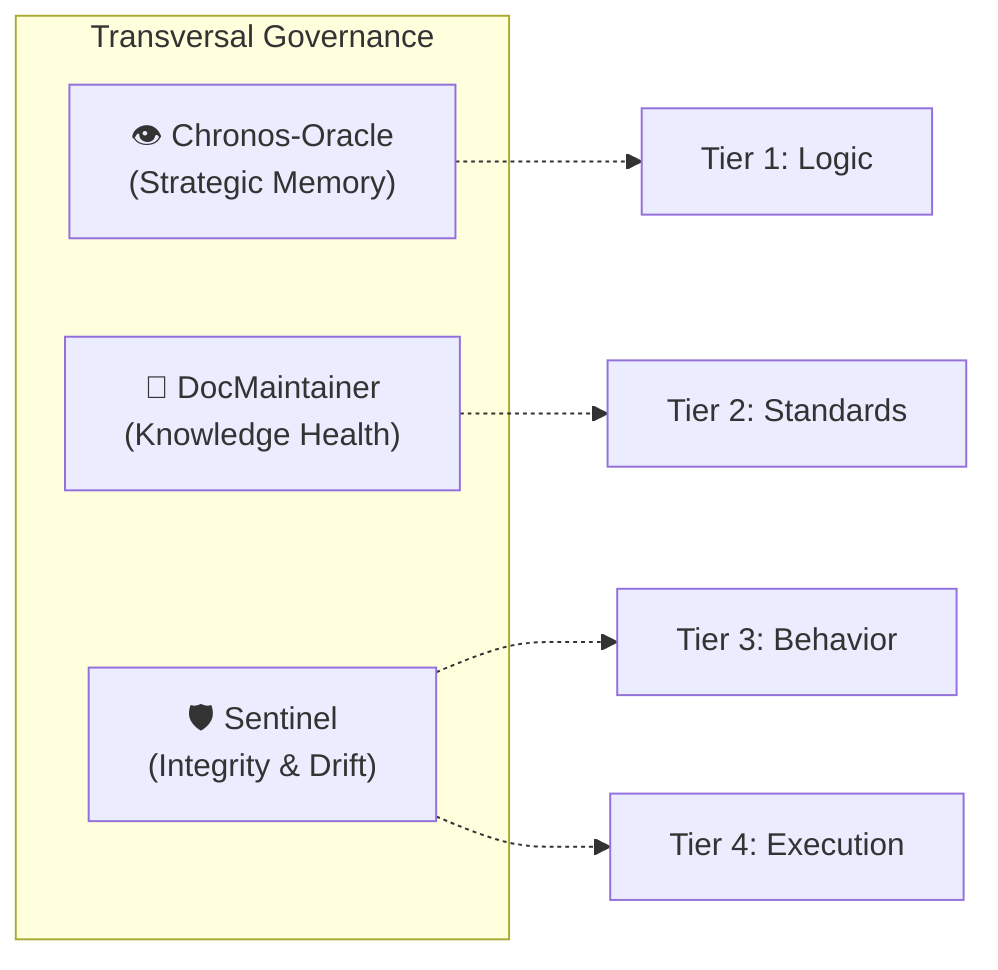

# 🌌 Bastien-Antigravity: Architecture Overview

Welcome, Human. This document provides a high-level visual and structural map of the **Bastien-Antigravity Ecosystem**. It explains how the Knowledge Management System (KMS), the AI Squad, and the Microservice Fleet work together.

---

## 🏗️ The 4-Tier AI-KMS Architecture

The ecosystem is built on a layered knowledge hierarchy. This separation ensures that the **Stateless AI Engine** can be updated globally without conflicting with project-specific logic.

- **Tier 1 (Core)**: The "Operating System." Pure instructions for the AI agents.
- **Tier 2 (Stack)**: The "Engineering Standards." Defines how we build (Go, Rust, Python).
- **Tier 3 (Behavior)**: The "Product Specs." Human-readable Given/When/Then requirements.
- **Tier 4 (Fleet)**: The "Reality." The actual microservices running in the real world.

---

## 🛡️ The 3-Zone Operational Strategy

To balance **Speed** vs **Safety**, the `obsidian-brain` vault is divided into three operational zones.

1.  **Zone 1: Frozen (Spec-First)**: High-safety zone. No code changes allowed without matching BDD specs.
2.  **Zone 2: Fluid (Labs)**: High-speed zone. Rapid experimentation and "Idea-to-Code" sprints.
3.  **Zone 3: Fleet (Operations)**: The command center for the 25+ repositories. Tracks logs, migrations, and fleet health.

---

## 🎮 Command & Control (Orchestration)

The ecosystem is orchestrated by the **AI Squad**, managed through centralized scripts in the vault root.

| Tool | Purpose | Key File |
| :--- | :--- | :--- |
| **Squad Orchestrator** | Launches the AI CLI with Protocol Modes. | `20-Scripts/start_squad.py` |
| **Fleet Commander** | Manages mass-repo commits, syncs, and branches. | `05-Fleet-Operation/00-Repo-Control/fleet-manager.py` |
| **Strategic Oracle** | Analyzes logs to prevent architectural drift. | `01-Strategic-Nexus/` |
| **DocMaintainer** | Enforces metadata standards and link health. | `07-Core-KMS/Role-Prompts/05-DocMaintainer/` |

---

## 🔗 Repository Structure (The Submodule Hub)

`obsidian-brain` acts as the **Parent Wrapper**. All other "Brains" are injected as Git Submodules to ensure atomic updates and portability.

---

## ⚡ The Life of a Feature

1.  **Ideation**: A "Pitch" is written in `04-Rapid-Prototyping`.
2.  **Prototyping**: The AI builds a working demo in a Lab branch.
3.  **Refinement**: The feature "Graduates." BDD specs are moved to `02-Business-BDD`.
4.  **Implementation**: The Lead Developer implements the code in the target Microservice.
5.  **Verification**: The QA Agent verifies the code against the BDD specs using `sandbox-testing`.
6.  **Deployment**: The Fleet Commander pushes the verified changes to the global fleet.

---

## 🛰️ The Transversal Intelligence Layer

Beyond the standard build-pipeline, the ecosystem is governed by **Transversal Roles**. These agents operate across all tiers to ensure long-term stability and strategic coherence.

### 👁️ Role 00: Chronos-Oracle (Strategic Memory)
- **Integration**: Operates in **01-Strategic-Nexus**.
- **Duty**: Analyzes session logs and deployment history to identify "Architectural Amnesia." It focuses on the **"Why"** behind decisions to prevent recurring debates and reasoning drift.

### 🛡️ Role 09: Sentinel (Integrity Auditor)
- **Integration**: Injected during the **Preflight Check** (`start_squad.py`).
- **Duty**: Acts as the "Border Control." It runs the `Brain-Health-Audit` to ensure that no mission starts if the KMS is in a state of drift or incoherence.

### 🧹 Role 05: DocMaintainer (Knowledge Health)
- **Integration**: Operates on the **Connective Tissue** of the vault.
- **Duty**: Scans for broken links, missing metadata, and tag dilution. It ensures that the "Semantic Graph" remains navigable for both humans and other AI agents.

---
> [!TIP]
> Always start your session by reading the **[[Ecosystem-Map-MOC]]** to see the current fleet health and active tasks.
