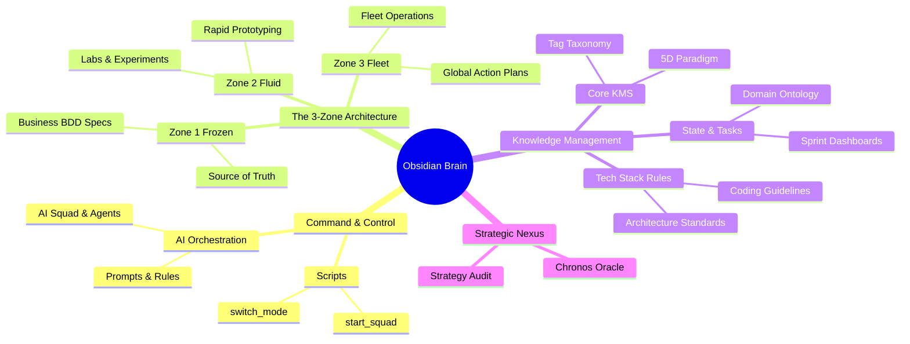
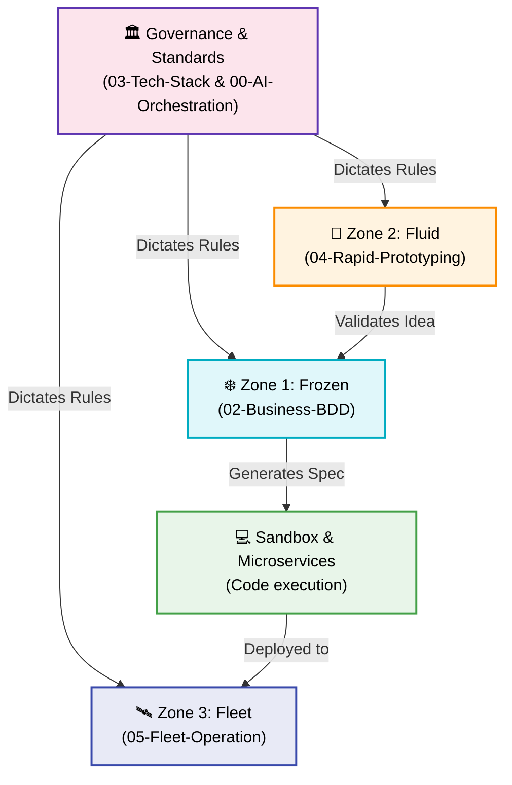

# 🧠 Obsidian Brain: Features & Behavior

The `obsidian-brain` repository serves as the **Global Memory** and **Strategic Command Center** for the entire Bastien-Antigravity ecosystem. It orchestrates AI agents, manages behavioral specifications, and dictates architectural standards.

## 🗺️ Core Architecture & Behavior Mind Map

## 🔄 Knowledge Flow (The 5D Paradigm)

This graph illustrates how knowledge flows and governs the ecosystem:

## 🎯 Key Behaviors

1. **Multi-Mode Engine**: Operates in different protocols (Spec-First, Labs, Fleet) to balance stability with speed.
2. **AI Agent Delegation**: Uses specialized subagents (Architect, Sentinel, Developer, Oracle, QA, DocMaintainer) to enforce standards and isolate operational context.
3. **Behavior-Driven Quality**: Enforces that all execution code must stem from a BDD specification in `02-Business-BDD` and be tested in the `sandbox-testing` hub.
4. **Zettelkasten Connectivity**: Utilizes atomic notes, dynamic tracking (via Dataview), and Maps of Content (MOCs) to maintain a highly connected, easily navigable strategic graph.
